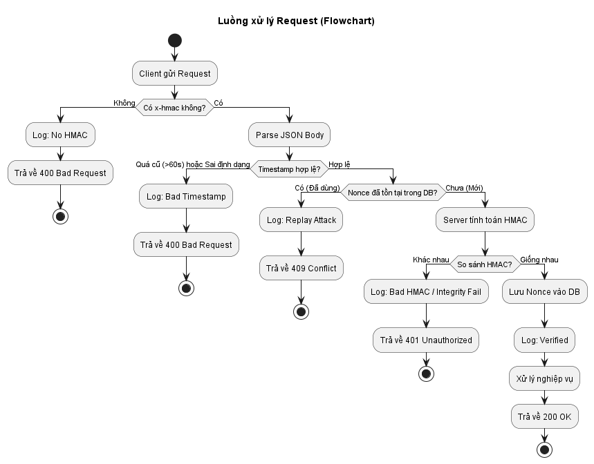
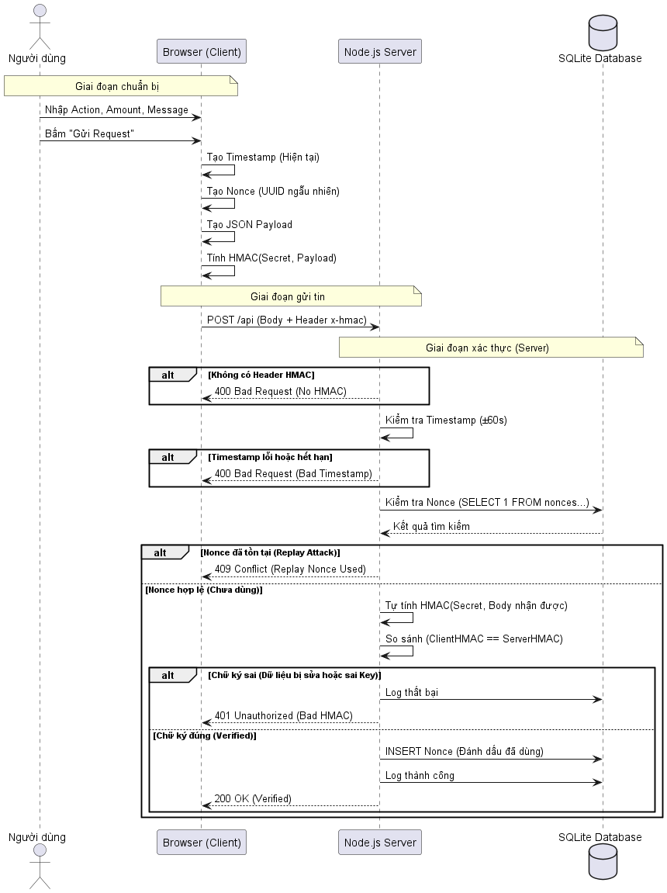

# HMAC Security Demo

Dự án minh họa kỹ thuật bảo mật API sử dụng **HMAC (Hash-based Message Authentication Code)** kết hợp với **Timestamp** và **Nonce** để đảm bảo tính toàn vẹn dữ liệu, xác thực nguồn gốc và chống tấn công phát lại (Replay Attack).

## 🚀 Tính năng

*   **Tính toàn vẹn (Integrity):** Sử dụng HMAC-SHA256 để đảm bảo dữ liệu không bị thay đổi trên đường truyền.
*   **Xác thực (Authentication):** Chỉ client có `Secret Key` đúng mới có thể gửi request hợp lệ.
*   **Chống Replay Attack:** Sử dụng cơ chế Timestamp (giới hạn thời gian) và Nonce (mã dùng một lần) để ngăn chặn việc gửi lại các gói tin cũ.
*   **Giao diện trực quan:** Web Client tích hợp sẵn để gửi request và xem log server theo thời gian thực.
*   **Lưu trữ Log:** Sử dụng SQLite để lưu trữ lịch sử các request và trạng thái xác thực.

## 🛠 Cài đặt

1.  **Yêu cầu:** Node.js (v18 trở lên).
2.  **Cài đặt dependencies:**

```bash
npm install
```

## ▶️ Chạy ứng dụng

1.  **Khởi động Server:**

```bash
npm start
```

Server sẽ chạy tại: `http://localhost:5000`

2.  **Sử dụng:**
    *   Mở trình duyệt và truy cập `http://localhost:5000`.
    *   Nhập thông tin giao dịch và bấm **Gửi Request**.
    *   Xem kết quả trả về và log chi tiết ngay trên giao diện.

## 📊 Thiết kế hệ thống

### Flowchart


### Sequence Diagram



## 📝 Kịch bản 

1.  **Happy Path:** Gửi request với Secret Key đúng -> Server trả về `200 OK`.
2.  **Sai Key:** Đổi Secret Key thành chuỗi bất kỳ -> Server trả về `401 Unauthorized` (Bad HMAC).
3.  **Replay Attack:**
    *   Bỏ chọn "Tự động thêm Timestamp & Nonce".
    *   Gửi request lần 1 -> Thành công.
    *   Gửi lại request đó lần 2 -> Server trả về `409 Conflict` (Replay nonce used).
4.  **Hết hạn (Expired):** Chỉnh sửa code hoặc chặn request quá 60s (khó test trên UI chuẩn, cần tool chặn gói tin) -> Server trả về `400 Bad Request` (Timestamp out of window).
